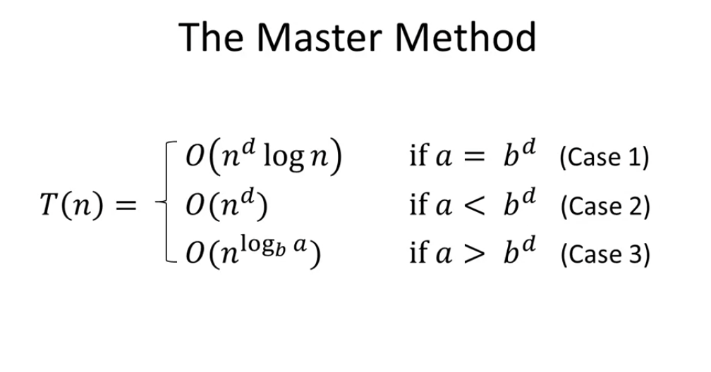

# Master method

## Motivation

Potentially useful algorithmic ideas often need a mathematical analysis to evaluate them

## Recursive algorithms

Recurisve algorithms use a "recurrence"

T(n) = recurrence = maximum number of operations this algorithm needs to multiply two n-digit numbers

**Recurrence:** is a way to express T(n) in terms of the work done by it's recursive calls

**Base case:** T(1) <= constant

**General cases (all n>1):** Two parts: 1) work done in recursive calls and 2) work done outside of recrusive calls

For integer multiplication
**Algorithm #1**
Recurisvely compute ac, ad, bc, bd, then compute the final expression `(10**n)(ac) + (10**(n/2))(ad+bc)+bd`. That's 4 recurisve calls and each is invoked on a pair of n/2 digit numbers so, T(n) <= 4 T(n/2). Outside of the recursive calls, we do addition which is O(n), so T(n) <= 4T(n/2) + O(n)

**Algorithm #2 (Gauss)**
Recursively compute ac, bd, (a+b), (c+d) --> final quantity is the third product is `(c+d) - ac - bd`. That's 3 recurisve calls and each is invoked on a pair of n/2 digit numbers so, T(n) <= 3 T(n/2). Outside of the recursive calls, we do addition which is O(n), so T(n) <= 4T(n/2) + O(n)

## Mathematical definition of the master method

**Cool feature:** A "black box" for solving recurrences
**Assumption:** All subproblems have equal size

1. **Base case:** T(n) <= a constant for all sufficiently small n (recursive calls stop)
2. **For all larger n:** T(n) <= aT(n/b) + O(n\*\*d) "a different recursive calls each on an input of size n/b"
   where
   a = number of recursive calls (>=1)
   b = input size shrinkage factor (>1)
   d = exponent in the running time of the combined step -- amount of time in the "combine" step (>=0)

a, b, d are independent of n

## Master method runtime

## Examples

### Merge Sort

a = number of recursive calls = 2
b = factor by which n shrinks = 2
c = amount of work done outside the recursive calls = 1

Master method case 1: `O(n * logn)`

### Binary search

a = 1 because recurse on half of the array (not both sides of the split
b = 2 because split in half
d = 0 because no work outside of recursive calls --> you just land on the base case

Master method case 1: `O(n * logn)` which in this case becomes `O(logn)`

### Basic integer multiplication

a = 4  
b = 2  
d = 1 (linear)

Master method case 3: `O(n ** (log_2(4)) == O(n**2)`

### Integer multiplication with Gauss' trick

a = 3  
b = 2  
d = 1

Master method case 3: `O(n**(log_2(3))) = O(n**1.59)`

## Strassen's matrix multiplication

a = 7
b = 2
d = 2

Master method case 3: `O(n**(log_2(7))) = O(n**2.81)`

## Fictitious recurrence

T(n) <= 2T(n/2) + O(n\*\*2)

a = 2
b = 2
d = 2 --> non-linear outside of recurrence

Master method case 2: `O(n**2)`

## Interpretation

a and b\*\*d have intuitive meanings --> it's a tug of war between "good" and "evil"

a = rate of subproblem proliferation (RSP) "evil"
b\*\*d = rate of work shrinkage per subproblem (RWS)

b\*\*d not b, because b is a measure of size of input size at each subproblem, but b\*\*d captures the amount of work by taking into account whether or not it's linear, quadratic, exponential, etc. work on each input

Three cases of master method correspond to outcomes in this tug of war:
Case 1 --> tie
Case 2 --> good wins
Case 3 --> evil wins
