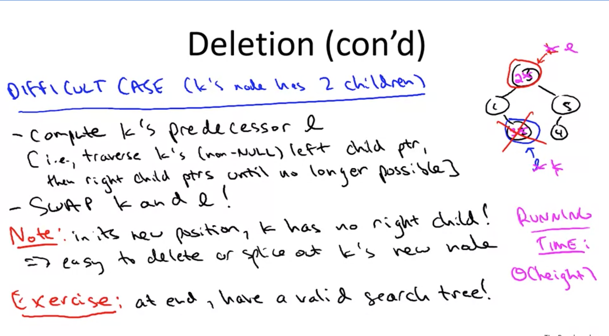
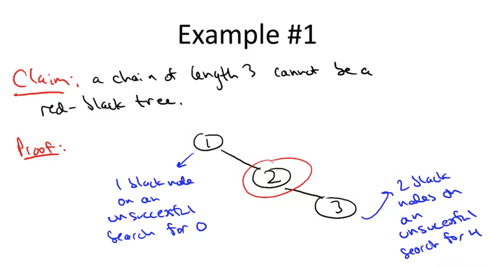

# Balanced Binary Search Trees

Think of it as a dynamic sorted array

## Sorted array operations (static)

- Search -> O(logn) -> you throw out half each time
- Select (given order statistic i) -> O(1) -> because sorted
- Min/max -> O(1) -> because sorted
- Predecessor/successor (given pointer to a key) -> O(1) -> becaause sorted
- Rank (i.e., # of keys less than or equal to a given value) -> O(logn) -> no harder than search
- Output keys in sorted order (from smallest to largest) -> O(n) -> just need to read through all the items in order

## Balanced binary search tree operations (dynamic)

We give up a little from the sorted arrays, to get a lot of speed on insertion and deletion

So, the reason binary search trees exist is for the insertion and deletion operations -> it's a sorted list, but we can quickly add and delete elements

- Search -> O(logn)
- Select -> O(logn) (up from O(1))
- Min/max -> O(logn) (up from O(1))
- Pred/succ -> O(logn) (up from O(1))
- Rank -> O(logn)
- Output in sorted order O(n)
- Insertions -> O(logn) (new)
- Deletions -> O(logn) (new)

If you only need insertions, deletions, and remembering the smallest, a binary search tree is overkill -> just use a heap! It's faster.

If you just need to be able to do insertions and lookups (don't need ordering), the data structure of choice is a hash table.

Balanced binary search tree has a very rich set of operations for working with data.

## Implementation summary

- 1-1 correspondence of nodes and keys
  - We'll focus on just the key, but usually there is more data there that we want too
- Search tree property: "stuff to the left is smaller than you, stuff to the right is bigger than you"
  
- Height of a BST
  - Height could be anywhere from approx. log2(n) (best case, perfectly balanced) to log(n) (height = n-1 if chain)

## Operations

**Search** for key k in tree T:

- Start at the root
- Traverse left if k < key at current node or right if k > key at current node as needed
- Return node with key k or NULL as appropriate

Running time: O(height)

**Insert** a new key k into tree T:

- Search for k (unsuccessfully)
- Rewire final NULL pointer to point to new node with key k

Running time: O(height)

**Min** / **Max**

- Start at root
  - Follow left/right child pointers until you can't anymore, then return last key found

**Predecessor** / **Successor**

- Easy case: if k's left subtree nonempty, return max key in left subtree
- Otherwise: follow a parent pointer until you get to a key less than k (happens the first time you "turn left" on the way to the parent pointer)
- For successor, switch the above

Running time: O(height)

**In-order traversal**
To print out keys in increasing order:

- Let r = root of search tree, with subtrees T_L (left subtree) and T_R (right subtree)
- Recurse on T_L
  - Prints out keys of T_L in increasing order
- Print out R's key
- Recurse on T_R
  - Print's out keys of T_R in increasing order

Running time: O(n) (n recursive calls, constant time for each)

**Deletion**
In most data structures, deletion is the most difficult operation.

To delete key k from a search tree:

- Search for k

**Easy case** (k has no children)

- Just delete k's node from tree, done

**Medium case** (k's node has one child)

- Just "splice out" k's node, and k's child assumes the position previously held by k's node

**Difficult case** (k's node has two children)

- Compute k's predecessor l (i.e., traverse k's non-null left child pointer, then right child pointers until no longer possible)
- Swap k and l! -> temporarily disrupts search tree property
- Remove k -> restores search tree property

Running time: O(height)

**Select**
**Idea:** store a little bit of extra info at each tree about the tree itself (i.e., not aobut the data)

**Example augmentation:** size(x) = # of tree nodes in subtree routed at x

Note: If x has children yand z, then size(x) = size(y) + size(z) + 1

Also: Easy to keep sizes up-to-date during an insertion or deletion

How to select ith order statistic from augmented search tree (with subtree sizes)

- Start at root x, with children y (left) and z (right)
- Let a = size(y) [a=0 if x has no left child]
- If a = i-1, return x's key
- If a >= i-1, recursively compute ith order statistic of search tree rooted at y
- If a < i-1, recursively compute the (i-a-1)th order statistic of search tree rooted at z

Running time: O(height)

## Red-black trees

Search trees that are guaranteed to stay balanced (so height will be logarithmic in n, meaning the operation time is better than worst case where height=n)

Idea: Ensure that height is always O(logn) [best possible] -> search/insert/delete/min/max/pred/succ will then run in O(logn) time [n=# keys in tree]

Example: red-black trees, AVL trees, splaytrees, B trees and B+trees

### Red-black invariants

1. Each node stores one extra bit of information at each node: red or black (0 or 1)
2. Root is black
3. (Main invariant) Never allow 2 red nodes in a row --> if you have a red node, then its children must be black
4. (Main invariant) Every path you can take from a root to the null pointer (like in an unsuccessful search) has the same number of black nodes

These invariants force trees to be balanced

Claim: Even a chain with tree nodes cannot be a red-black tree

### Height guarantee

Claim: Every red-black tree withn nodes has height <= 2log_2(n+1)

(The red-black invariants enforce that the tree is balanced with, at most, a factor 2 inflation)

Proof:

- Observation: if every root-NULL path has >= k nodes, the tree includes (at the top) a perfectly balanced tree of depth k -> size n of the tree must be at least (2\*\*k)-1

Story so far:
Size n > (2\*\*k) - 1, where k = minimum number of nodes on root-NULL path -> k <= log_s(n+1)

Thus: In a red-black tree with n nodes, there is a root-NULL path with at most log_s(n+1) black nodes

By 4th invariant: Every root-NULL path has <= log_2(n+1) black nodes

By 3rd invariant: every root-NULL path has <= 2log_2(n+1) total nodes
