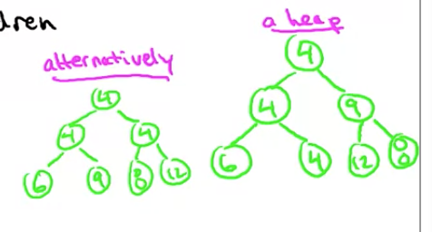
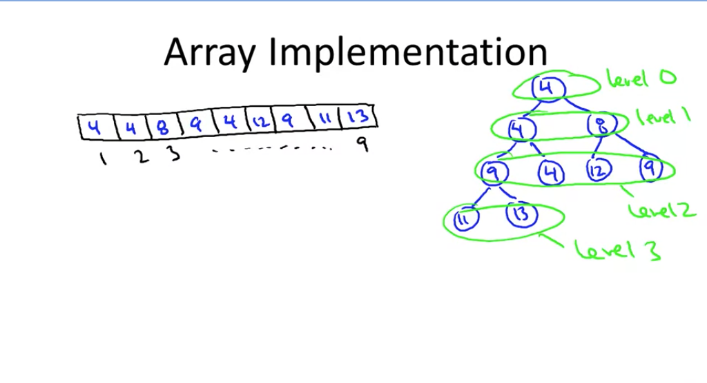

# Heaps

## Supported operations
A container for objects that have keys:
    * Employer records
    * Network edges
    * Events
    * Etc.

Two main operations (where n is number of objects in heap):
* Insert: add a new object
    * Running time: O(logn) time
* Extract-min: Remove an object in heap with a minimum key value [ties broken arbitrarily] --> can also be max, but not min and max simultneously
    * Running time: O(logn) time

Other operations:
* Heapify: n batched inserts
    * Running time: O(n) time
* Delete: Delete an arbiterary element fmor the middle of a heap
    * Running time: O(logn) time

## Application: sorting
__Canonical use of a heap:__ fast way to do repeates minimum computations

__Example:__ Selection sort --> n number of o(n)) linear scans --> O(n**2) runtime on array of length n

__Heapsort:__
1. Insert all elements into heap, then extract them all one by one
2. Extract-min to pluck out elements in sorted order

Running time = 2n heap oeprations = O(nlogn) time (optimal for a comparison based sorting application)

## Application: event manager
Synonymous name: "priority queue"

Example: simulation (e.g. for a video game)
* Objects = event records [action/update to occur at given time in the future]
* Key = time event is scheduled to occur
* Extract-min -> yields the next scheduled event

## Application: median maintenance
You're given: a sequence x_1, ..., x_n of numbers, one-by-one
You tell me: at each time step i, the median of {x_1, ..., x_i}
Constraint: you have O(log i) time at each step i to calculate the median
Solution: use two heaps:
* Heap H_low: supports extract-min
* Heap H_high supports extract-max

Key idea: maintain invariant that approx. i/2 smallest (largest) elementsin H_low (H_high)

## Application: sppeding up dijkstra
Dijkstra's shortest-path algorithm
* Naive implementation -> run time = O(n*m) (n = number of loop iterations and m = work per iteration)
* With heaps -> runtime = O(m*logn)

## Implementation summary
Two views of a heap:
* as a tree
* as an array

Conceptually: think of a heap as a tree
* rooted, binary, as complete as possible

Heap property: at everynode x, key[x] <= all keys of x's children -> i.e. smallest on top (root) of tree

The same objects can be arranged multiple ways, and it would still be a heap

We _think_ of it as a heap, but we implement it as an array:

Note: parent(i) = {i/2 if even; ⌊i/2⌋ (floor division) if i odd}

