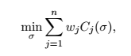

# Greedy Algorithms

## Greedy algorithms
__Definition:__ iteratively make "myopic" decisions, hope everything works out at the end
__Example:__ Dijkstra's shortest path algorithm
- processed each destiantion once, irrevocably

Contrast with divide & conquer
1. Easy to propose multiple greedy algorithms for many problems
2. Easy running time analysis (contrast with master method)
3. Hard to establish correctness (contrast with straightforward inductive correctness proofs)

__Danger:__ most greedy algorithms are _not_ correct (even if your intuition says so!)

## Proof of correctness:
Method 1: Proof by induction --> "greedy stays ahead" --> induction made on each of the decisions of the algorithm
Example: Correctness proof for Dijsktra's algorithm

Method 2: Exchange argument
* start by saying the algorithm is not correct, then prove it is

Method 3: Whatever works! Sometimes it's not clear what the best approach is

## Application: Optimal caching
The caching problem:
* There is a small fast memory (the cache)
* There is big slow memory (the main memory)

The task:
* Process a sequence of "page requests"
* On a "fault" (that is, a cache miss), need to evict something from the cache to make room for the thing that isn't already there

## Example
Cache: a, b, c, d
Request sequence: c, d, e

e isn't in the cache, so maybe we evict a to make room for e (cache: e, b, c, d)... and so on... but then what if a (or something else we evicted comes back in the sequence?)

## The optimal caching algorithm
__Theorem:__ the "furthest-in-future" algorithm is __optimal__ (i.e., minimizes the number of cache misses)

--> this assumes you know what is coming in the future

__Why is it useful?__
1) Serves as a guideline for practical algorithms (e.g. LRU (least-recently used) cache should do well)
* LRU --> assumes the most recently requested recently will be requested again sooon, and the data referenced furthest in the past will be referenced furthest in the future (does well provided data exhibits locality of reference)
2) Serves as idealized benchmark for caching algorithms (e.g., if you implement LRU, you can cross-validate it with what actually happens, after the future happens)

__Proof:__ tricky exchange argument, not covered in this course, however

### Application: scheduling
* Tasks to be completed are called jobs
* Each job j has a known length l_j, which is the amount of time required to process the job
* Each job j has a known weight w_j, with higher weights corresponding to higher priority jobs
* The schedule is the order in which to process the jobs
* In a problem with n jobs, there are n! different schedules
* We need to define an objective function that assigns a numerical score to every schedule

Completion times: The completion time of job j in schedule s is the sum of the lengths of the jobs preceding j in s, plus the length of j itself (the total time elapsed before the job has been processed)

### Objective function
There are tradeoffs: jobs scheduled early have short completion times, while those scheduled later have long completion times

One way to make trade-offs between jobs is to minimize the sum of weighted completion times. The objective function translates to the following, where sigma is the schedule and C_j is the completion time of job j in schedule sigma. (Minimizing the weighted average of completion times, with averaging weights proportional to w_js):

## Two special cases
The first step is to solve two special cases of the general problem, then use those to suggest what a greedy algorithm would look like in the general case.

1) If all jobs have the same length, schedule them from largest weight to smallest weight

2) if all jobs have same weight, schedule from shortest length to longest length

__Question:__ What is w_i > w_j, but l_i > l_i?
__Idea:__ Assign "scores" to jobs that are:
* Increasing in weight
* Decreasing in length

Guess 1: order jobs by decreasing value of w_j - l_j
Guess 2: order l_j / w_j

To distinguish and rule one out: find an example where the two algorithms produce different outputs (at least one will be incorrect)

Example: l_1 = 5; w_1 = 3; l_2 = 2; w_2 = 1

__Question:__ What is the sum of weighted completion times of algorithms 1 and 2 respectively? 23 and 22 --> so we know algorithm one is not correct. We don't know if algorithm two is correct.

It turns out that algorithm 2 is actually correct.

## Proof
__Claim:__ Ordering jobs by decreasing ratio weight / length is always correct

__Proof:__ By an exchange argument

