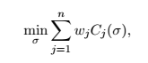

## Greedy Algorithm Application: scheduling
* Tasks to be completed are called jobs
* Each job j has a known length l_j, which is the amount of time required to process the job
* Each job j has a known weight w_j, with higher weights corresponding to higher priority jobs
* The schedule is the order in which to process the jobs
* In a problem with n jobs, there are n! different schedules
* We need to define an objective function that assigns a numerical score to every schedule

Completion times: The completion time of job j in schedule s is the sum of the lengths of the jobs preceding j in s, plus the length of j itself (the total time elapsed before the job has been processed)

### Objective function
There are tradeoffs: jobs scheduled early have short completion times, while those scheduled later have long completion times

One way to make trade-offs between jobs is to minimize the sum of weighted completion times. The objective function translates to the following, where sigma is the schedule and C_j is the completion time of job j in schedule sigma. (Minimizing the weighted average of completion times, with averaging weights proportional to w_js):

### Two special cases
The first step is to solve two special cases of the general problem, then use those to suggest what a greedy algorithm would look like in the general case.

1) If all jobs have the same length, schedule them from largest weight to smallest weight

2) if all jobs have same weight, schedule from shortest length to longest length

__Question:__ What is w_i > w_j, but l_i > l_i?
__Idea:__ Assign "scores" to jobs that are:
* Increasing in weight
* Decreasing in length

Guess 1: order jobs by decreasing value of w_j - l_j
Guess 2: order l_j / w_j

To distinguish and rule one out: find an example where the two algorithms produce different outputs (at least one will be incorrect)

Example: l_1 = 5; w_1 = 3; l_2 = 2; w_2 = 1

__Question:__ What is the sum of weighted completion times of algorithms 1 and 2 respectively? 23 and 22 --> so we know algorithm one is not correct. We don't know if algorithm two is correct.

It turns out that algorithm 2 is actually correct.
