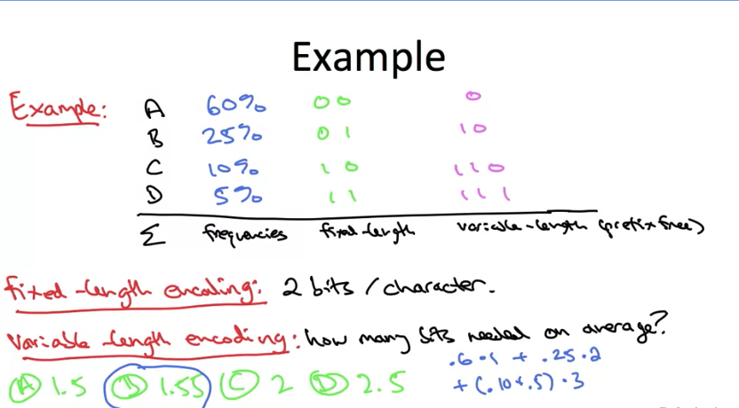
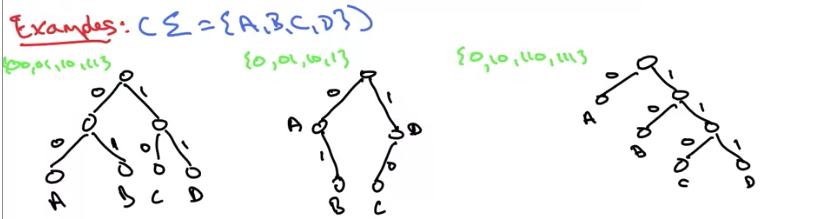
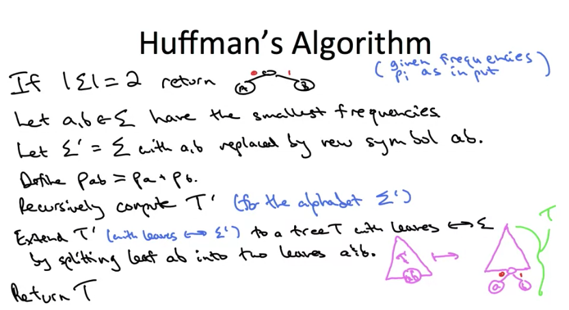

# Huffman Codes

## General

**Use:** for constructing a certain kind of prefix-free binary code

**Binary code:** maps each character to an alphabet Σ to a binary string

**Example:** Σ = a - x and various punctuation (size 32 overall, say)

**Obvious encoding:** use the 32 5-bit binary string to encode this Σ (a fixed length) (2\*\*5 = 32)

**Can we do better?:** yes, if some characters of Σ are much more frequent than others, usnig a variable-length code

## Ambiguity

An issue arises when you pass fixed-length encodings to variable-length encodings

**Example:** suppose Σ = {A, B, C, D}. Fixed length encoding would be {00, 01, 10, 11}; if instead we use {0, 01, 10, 1}, how do we decode sequence 001? we can't without more information

The solution is prefix-free codes

## Prefix-free codes

**Problem:** with variable-length codes, not clear where one character ends + the next one begins

**Solution:** prefix-free codes -- make sure that for every pair i, j ∈ Σ, neither of the encodings f(i), f(j) is a prefix of the other

**Example:** alphabet {A, B, C, D} encoded to {0, 10, 110, 111}

## Problem definition

### Codes as trees

**Goal:** best binary prefix-free encoding for a given set of character frequencies

**Useful fact:** binary codes <--> binary trees

Examples: Σ = {A, B, C, D}

Left: fixed length encoding
Middle: variable-length encoding that is NOT prefix-free (that's why intermediate nodes are labeled) (labeled non-leaf nodes -> not a complete binary tree)
Right: variable-length PREFIX-FREE encoding with only leaf nodes labeled

### Prefix-free codes as trees

**In general:**

- left child edges <--> 0; right child edges <--> 1
- for each i ∈ Σ, exactly 1 node labeled i
- encoding of i ∈ Σ <--> bits along path from root to the node [since prefixes <--> one node an ancestor of another]

**To decode:** repeatedly follow path from the root until you hit a leaf [ex: 0110111] [unambiguous, since only leaves are labeled]

**Note:** encoding length of i ∈ Σ = depth of i in tree

### Problem definition

**Input:** probability p_i for each character i ∈ Σ
**Notation:** if T=tree with leaves <--> symbols of Σ, then L(T) = average length encoding = Σ (sum over i ∈ Σ) p_i \* [depth of i in T] = average depth of i in T where weights are p_i

**Output:** a binary tree T minimizing the average encoding length L(i)

## The solution

### Building a tree

**Question:** whaht's a principled approach for buildin a tree with leaves <--> symbol of Σ
**Natural but suboptimal idea:** top-down / divide and conquer

- partition Σ into Σ, Σ_2 each with ~50% of total frequency
- recursively compute T for Σ, T_2 for Σ, return the tree

**Huffman's (optimal) idea:** build tree bottom-up, using successive mergers

**Question:** which pair of symbols is "safe" to merge?
**Observation:** final encoding of i ∈ Σ = # of mergers its subtree endures --> we want to merge is from least to most frequency

### How to recurse?

**Suppose:** 1st iteration of algorithm merges symbols a & b
**Idea:** replace the symbols a, b by a new meta symbol with p_a + p_b

**Actual recusion:**

- merge together least probable symbols, treat these merged symbols as a meta-symbol with p_meta_symbol = sum(prob of all symbols in meta symbol)
- the tree is built by reversing the bullet above

### Huffman's algorithm

