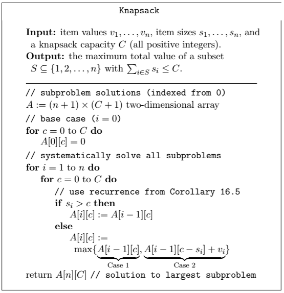
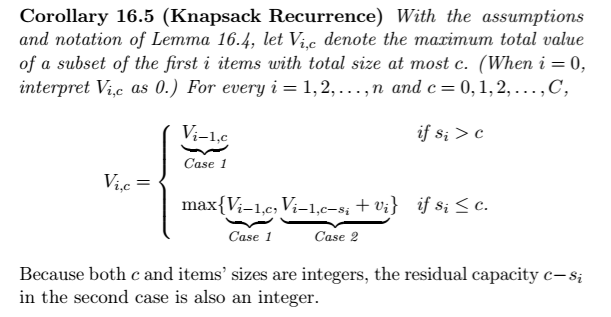
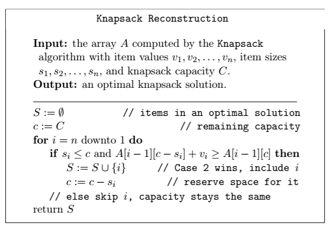

# The Knapsack Probelm
__Input:__ n items. Each has a value:
* value v_i (nonnegative)
* size w_i (nonnegative and integral)
* capacity w (a nonnegative integer)

__Output:__ a subset S ⊆ {1, 2, 3,..., n} that maximizes the total contents of the items subject to being less than or equal to the capacity of the "knapsack"

## Developing a dynamic programm algorithm
__Step 1:__ formulate recurrence [optimal solution as a function of solutions to "smaller" subproblems] baked on structure of an optional solution

Let S = a max-value solution to an instance of knapsack

Either an object is in the knapsack or it is not

__Case 1:__ suppose item n ∉ S --> S must be optimal with the first (n-1) items, because if S* were better than S with respect to the first (n-1) items, then this would be equally true wrt all n items, which is a contradiction

__Case 2:__ suppose items n ∈ S. Then S - {n} is an optimal solution wrt the first (n-1) items and capacity W-w_n --> if S* has a higher value than S-{n} + total size <= W-w_n, then s* ∪ {n} has size <= W and value more than S [contradiction]

## A recursive algorithm
__Notation:__ let V_i,x = value of the best solution that:
1) Uses only the first i items
2) has total size <=x

__Step 1:__ for i ∪ {1, 2, ..., n} and any x, V_i,x = Max {V_i-1,x  ;  V_i + V_i-1,x-w_i} --> if case 1 of max, item i excluded; if case 2 of max, item i included
^ that's the recurrence of the knapsack problem

__Edge case:__ if w_i > x, must have V_i,x = V_i-1, x

__Step 2:__ identify the subproblems
* all possible prefixes of items {1, 2, .., i}
* all possible (integral) residual capacities x ∈ {0, 1, 2, ..., W} --> peeling off items and peeling off portions of the knapsack capacity

__Step 3:__ use recurrence from step 1 to systematically solve all subproblems

__Running time:__ O(nW)